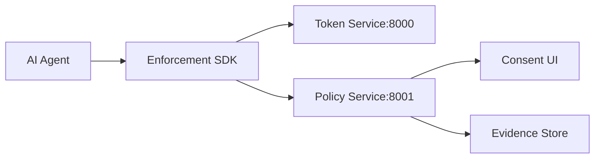

# Alloist Architecture

## What Alloist Does

Alloist is an **AI permission layer** that gates what AI agents can do before they execute actions. When an agent tries to send an email, charge a payment, or perform any gated action, Alloist checks:

1. **Token validity** – Does the agent have a valid, non-revoked capability token (JWT)?
2. **Policy** – Does the policy allow, deny, or require consent for this action?
3. **Consent** (optional) – For high-risk actions, does a human need to approve first?

If denied, the agent is blocked and receives an `evidence_id` for audit. If allowed (or approved via consent), the agent proceeds.

---

## Architecture Summary

Alloist consists of:

- **Token Service** (port 8000) – Mints signed capability tokens (JWTs), handles revocation, exposes JWKS for verification. Publishes revocation events via Redis for real-time propagation.
- **Policy Service** (port 8001) – Evaluates actions against JSON policies. Creates evidence records when actions are blocked. Manages consent requests and broadcasts them to connected clients.
- **Enforcement SDKs** (Python, Node) – Wrap agent actions. Before an action runs, the SDK verifies the token (locally with JWKS or remotely), checks policy, and blocks or allows.
- **Consent interfaces** – Browser extension (WebSocket) and mobile app (REST + push) for human approval of `require_consent` actions.
- **Evidence store** – Blocked actions produce signed evidence bundles for auditing and compliance.

---

## Key Flows

### 1. Mint token → Agent gets JWT

An operator (or admin UI) mints a token via `POST /tokens` with subject, scopes, and TTL. The agent receives the JWT and uses it for all subsequent action checks.

### 2. Agent attempts action → SDK checks → Allow / Deny / Require consent

1. Agent calls `enforcement.check(token, action_name, metadata)` before executing the action.
2. SDK verifies JWT signature (Ed25519) and expiration via JWKS.
3. SDK checks revocation cache (WebSocket) or calls `POST /tokens/validate`.
4. SDK calls `POST /policy/evaluate` with `token_id` and action.
5. Policy service returns:
   - `allowed: true` – Agent proceeds.
   - `allowed: false` – Agent is blocked; `evidence_id` is returned for export.
   - `consent_request_id` – Action requires human approval; agent waits for consent decision, then re-evaluates.

### 3. Blocked actions produce evidence bundles

When an action is denied, the SDK (or policy service) creates an evidence record. Auditors can export it via `POST /evidence/export` and verify the Ed25519 signature using the policy service’s public key. See [spec/SPEC.md](../spec/SPEC.md) for the evidence bundle format.

---

## Related Documentation

- [Getting Started](getting-started.md) – Run services, configure environment
- [API Reference](api-reference.md) – Token API, Policy API, consent, SDK, evidence
- [PHASE1_MVP.md](../PHASE1_MVP.md) – Phase 1 quick start and demos
- [PHASE6_README.md](../PHASE6_README.md) – Consent browser extension and mobile app
